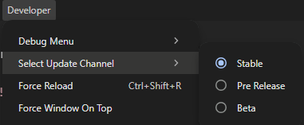

## Wheel of Names Changelog 
___________________________________________________________________________________________
___________________________________________________________________________________________

### Version 2.4.2

### Bug Fixes
- Corrected an issue where a discord user on PS4 or mobile would not be able to be moved to the channel
  - These members will no longer be moved.
  - Text on the winner dialog will now indicate if they are on mobile or desktop
- Removed the Close button from the winner dialog as it was not functioning as intended
  - There is still a small 'X' in the top right corner to close the dialog but this may break functionality 

___________________________________________________________________________________________
___________________________________________________________________________________________

### Version 2.4.1

Fixed styling for light mode in the discord settings page.

### Version 2.4.0

## Shameless Plug
Join my new discord community server for my software services updates and discussions!

Link under the discord settings page

### New Feature!
- Discord bot integration.  Optional install Menus > Discord > Settings
  - Select Server
  - Designate the channel you play in
  - Designate the channel viewers join to be added to the wheel
  - If a discord user wins they will automatically be moved to your channel
  
### Future implementations
- Viewer bot slash commands to sync discord users with either youtube or twitch accounts
- Ping or DM winners with details like channel to join and maybe a custom message?

#### Miscellaneous
- The release notes now scale with the screen size!

___________________________________________________________________________________________
___________________________________________________________________________________________

### Version 2.3.3

### Bug fix

- Corrected the behavior of the !remove command.
  - It will no longer remove the viewer and their chances but instead hide them only.
___________________________________________________________________________________________
___________________________________________________________________________________________

### Version 2.3.2

### Bug fix

- Corrected major bug that would reset viewer chances when using commands !wheel or !here
___________________________________________________________________________________________
___________________________________________________________________________________________

### Version 2.3.1

...light mode for Kai
___________________________________________________________________________________________
___________________________________________________________________________________________

### Version 2.3.0

### Bug update
- Fixed an issue where the wheel could be interrupted on some user commands
- The !wheel and !here counts now properly count up
- Fixed an issue where the !odds command was not properly responding with correct statements if the user was "hidden"

___________________________________________________________________________________________
___________________________________________________________________________________________

### Version 2.2.2

### Feature update
- The update window will now provide feedback on download progress
- The channel update menu has been improved to allow downloading of pre release versions
  - This will improve testing and reduce the number of bad deployments.

If you so choose to be brave:

___________________________________________________________________________________________
___________________________________________________________________________________________

### Version 2.2.1

### Bug Fix
- Youtube Authentication will now properly display connection status in the UI if tokens are expired.
- Additionally Replaced Red X with "Sign in to send Messages" for clarity
- Removed flicker from page reload resulting from ! commands
___________________________________________________________________________________________
___________________________________________________________________________________________

### Version 2.2.0

### Feature update
- The !wheel command now doubles as the !here command.  If a entry is able to be doubled the !wheel command will double and enable them
- !here now acts as the !wheel command
___________________________________________________________________________________________
___________________________________________________________________________________________

### Version 2.1.2

### Bug fix
- App now will load if no config exists - Sorry Kai!
___________________________________________________________________________________________
___________________________________________________________________________________________
### Version 2.1.1

### Minor Feature
- !remove now disables entry on wheel

___________________________________________________________________________________________
___________________________________________________________________________________________

### Version 2.1.0

### Feature Update!
- Reset !here button now hides all entries from the wheel
- Wheel winner buttons will now remove or hide based on button pressed
  - Close button does nothing
- Commands
  - !wheel enables entry on wheel
  - !here also enables entry on wheel
- New filter to sort for enabled entries
- New Sort filter added to show entries in ascending and descending order

### Optimization features
Wheel winner buttons now target saved config rather than relying on black magic along with hopes and prayers.

___________________________________________________________________________________________
___________________________________________________________________________________________

### Version 2.0.2

#### Bug Fix
- Youtube auth token expiration is now saved as a timestamp allowing for calculating the time remaining on app restart which could cause missing a refresh 
- Youtube customUrl is now used as the channel name in case customUrl and name are different. Due to the url youtube.com/@handle/live required to determine broadcast status
- !wheel / !here command counts fixed. Improper use of enums caused the issue
___________________________________________________________________________________________
___________________________________________________________________________________________

### Version 2.0.1

#### Bug Fix
- Twitch Auth Redirect in production build does not function like in dev. This has been fixed.
___________________________________________________________________________________________
___________________________________________________________________________________________

### Version 2.0.0

#### Features
- Authentication methods for Youtube and Twitch added to the menus
  - Application manages refresh tokens as well
  - YouTube will Refresh tokens while app is live. Google access tokens expire after one hour requiring sign in.
  - Check marks on main window indicated authentication status
- YouTube chat will now auto connect! No more button presses!!!
- New chat command !odds added. This command will send a message back to the viewer informing them of the odds of winning
  - Possible Messages:
    - @user your odds of winning are xx.xx% and you have x entries
    - @user your odds of winning are xx.xx% and you have x entries you can double your odds by typing !here
    - @user you have not entered the wheel yet with !wheel
- Message box will now show the service the viewer is on

___________________________________________________________________________________________
___________________________________________________________________________________________

### Version 1.2.0

#### Features
- Added twitch and youtube channel Ids to meta data to prevent same name collisions
- Added timestamp to meta data so on entry winning the amount of time since last activity will be shown
- Added time stamp data to entry cards on main screen
- Added three card sorting options. Activity, Weight and Alphabetical
- Added Remove Not Claimed Button ! Caution this will remove viewers from the list
  - Recommended workflow is to remove a not claimed before starting stream. Then reset the !here command

#### Notes
- As viewers chat their channelIDs will be added in the meta data. The chances of name collisions will decrease over time.
- Initially viewers that have no activity data who win on the wheel will have the winning message be set to "You're Next!"
___________________________________________________________________________________________
___________________________________________________________________________________________

### Version 1.1.0

#### Features
- Added a Release Notes feature modal that will display future changes
- These notes can be viewed at any time by using the file menu:
* ["Help -> changelog"]()

#### Notes
- Previous changelogs are brief summaries due to no changelogs being produced at the time.

___________________________________________________________________________________________
___________________________________________________________________________________________
### Version 1.0.0

#### Features
- Added Youtube Chat Support
  - You can now add your Youtube handle and connect to the current live broadcast

___________________________________________________________________________________________
___________________________________________________________________________________________

### Dark Ages Prior to v1.0.0

#### Features
- Twitch chat support
- Manual add viewers to list
- Integrated Wheel of Names website into the application.
- Auto updating Wheel of Names as chat commands are received
- Implemented command !wheel 
- Implemented command !here 
- Implemented command !remove
- Implemented clear chances button
- Implemented viewer search/filter input box
- Wheel of Names ad blocker
___________________________________________________________________________________________
___________________________________________________________________________________________